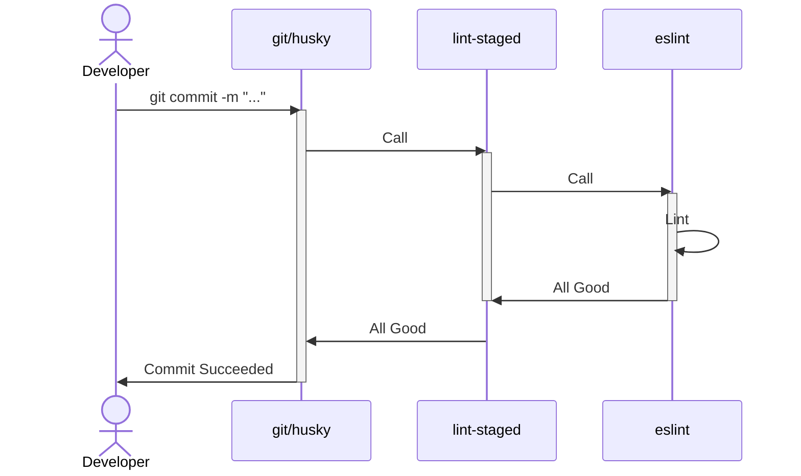
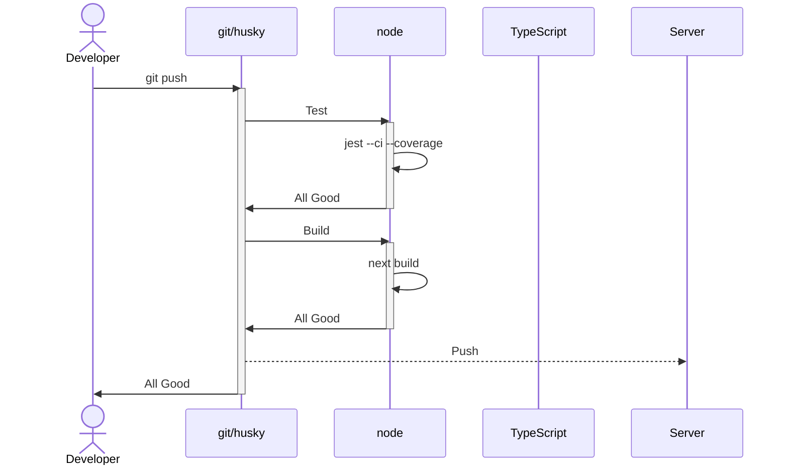
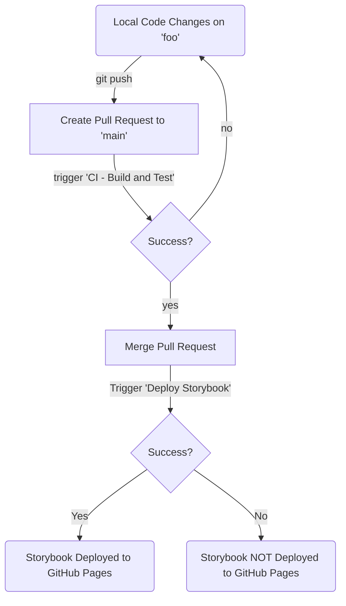

# Ryan's Next JS Template

This repository is my personal template for bootstrapping Next.JS projects.
It contains packages and baseline configurations for my most commonly used tools.
It is intended to get a project started quickly without spending hours setting up the environment.

## Tech Stack

### Front End Technology

This repository is based on [next.js][next] and is set up to use the App Router.
It is coded in [TypeScript][typescript].
It relies on minimal other front-end libraries:

1. **[recoil.js][recoil]**: For state management.
2. **[clsx][clsx]**: For class management.
3. **[client-only][client-only]/[server-only][server-only]** For component location enforcement.

Styles are handled using standard css modules.

### Linting

Several libraries are included to enforce coding styles and standards.
These are automatically enforced with [Husky][husky] hooks. (See [Husky](#husky) for more information.)

Code styles are enforced at commit time using [eslint][eslint] and [prettier][prettier]. [lint-staged][lint-staged] is used to run the linters.

Commit styles are enforced using [commitlint][commitlint]. See [Commit Styles](#commit-styles)

### Testing

Testing is done using [Jest][jest] and [testing-library]. Tests are run pre-push.

### Other

[Storybook][storybook] is configured for front-end component presentation.

## Husky

Husky is used to enforce pre-commit and pre-push hooks. See the below diagram for how and when these hooks are run.

### Pre Commit

### Pre Push

## Commit Styles

TODO

## GitHub Actions

[GitHub Actions][actions]are used to automate various tasks related to the repository.

### CI - Build and Test

Any pull request into `main` will trigger a CI run.
This run will build the site and run tests.
If either the build or test fails, the action will fail.
If the CI run fails, merging will not be allowed.
See [GitHub Setup](#github-setup) for more information.

There is also an action to deploy StoryBook to our [GitHub Pages][pages] site.
This action runs when a PR is merged into main.

### Deploy Storybook

When a PR is successfully merged into main. The Deploy Storybook action runs.
This action builds Storybook and deploys it to the site's GitHub pages.

### DependaBot Auto Merge and Approve

When Dependabot creates a PR, this action automatically approves it if status checks run.
If you are cloning this repo for a production critical application, consider disabling this action.

## GitHub Setup

[actions]: [https://github.com/features/actions]
[commitlint]: [https://commitlint.js.org/#/]
[client-only]: [https://www.npmjs.com/package/client-only]
[clsx]: [https://www.npmjs.com/package/clsx]
[eslint]: [https://eslint.org/]
[husky]: [https://www.npmjs.com/package/husky]
[jest]: [https://jestjs.io/]
[lint-staged]: [https://github.com/okonet/lint-staged/]
[next]: [https://nextjs.org/docs]
[pages]: [https://pages.github.com/]
[prettier]: [https://prettier.io/]
[recoil]: [https://recoiljs.org/]
[server-only]: [https://www.npmjs.com/package/server-only]
[storybook]: [https://storybook.js.org/]
[testing-library]: [https://testing-library.com/]
[typescript]: [https://www.typescriptlang.org/]
