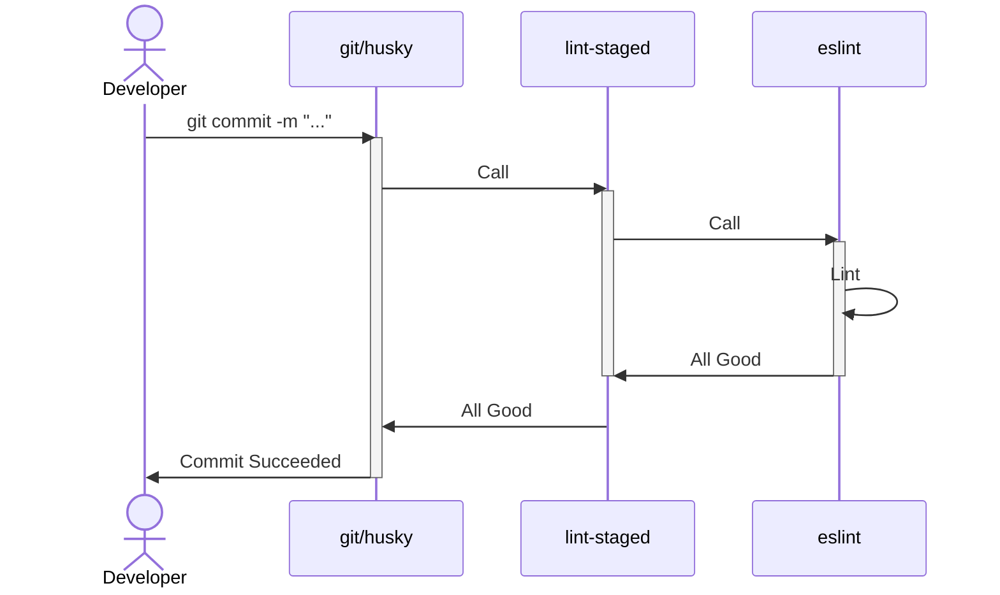
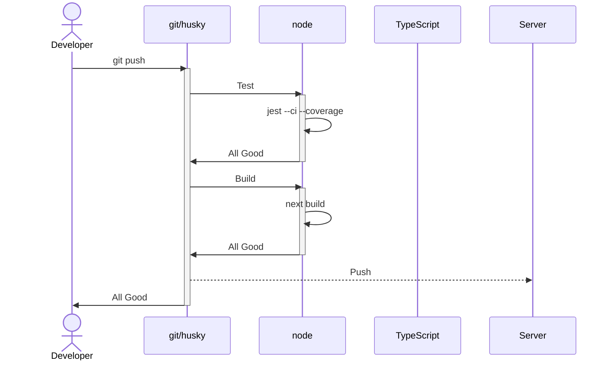

# Ryan's Next JS Template

This repository is my personal template for bootstrapping Next.JS projects.
It contains packages and baseline configurations for my most commonly used tools.
It is intended to get a project started quickly without spending hours setting up the environment.

## Tech Stack

### Front End Technology

This repository is based on [next.js][next] and is set up to use the App Router.
It is coded in [TypeScript][typescript].
It relies on minimal other front-end libraries:

1. **[recoil.js][recoil]**: For state management.
2. **[clsx][clsx]**: For class management.
3. **[client-only][client-only]/[server-only][server-only]** For component location enforcement.

Styles are handled using standard css modules.

### Linting

Several libraries are included to enforce coding styles and standards.
These are automatically enforced with [Husky][husky] hooks. (See [Husky](#husky) for more information.)

Code styles are enforced at commit time using [eslint][eslint] and [prettier][prettier]. [lint-staged][lint-staged] is used to run the linters.

Commit styles are enforced using [commitlint][commitlint]. See [Commit Styles](#commit-styles)

### Testing

Testing is done using [Jest][jest] and [testing-library]. Tests are run pre-push.

### Other

[Storybook][storybook] is configured for front-end component presentation.

## Husky

Husky is used to enforce pre-commit and pre-push hooks. See the below diagram for how and when these hooks are run.

### Pre Commit

### Pre Push

## Commit Styles

[commitlint]: [https://commitlint.js.org/#/]
[client-only]: [https://www.npmjs.com/package/client-only]
[clsx]: [https://www.npmjs.com/package/clsx]
[eslint]: [https://eslint.org/]
[husky]: [https://www.npmjs.com/package/husky]
[jest]: [https://jestjs.io/]
[lint-staged]: [https://github.com/okonet/lint-staged/]
[next]: [https://nextjs.org/docs]
[prettier]: [https://prettier.io/]
[recoil]: [https://recoiljs.org/]
[server-only]: [https://www.npmjs.com/package/server-only]
[storybook]: [https://storybook.js.org/]
[testing-library]: [https://testing-library.com/]
[typescript]: [https://www.typescriptlang.org/]
